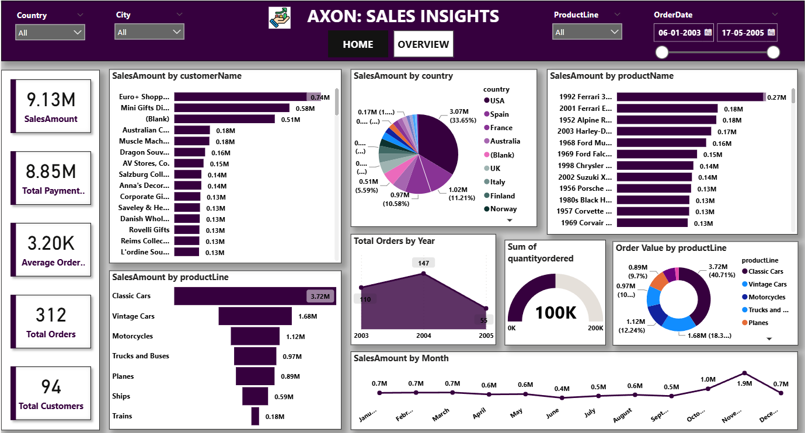

# Axon Sales Insights

*Power BI Capstone Project*

This project provides actionable insights into Axon company's sales data using Power BI. It helps users understand key sales metrics, trends, and performance through interactive dashboards.

---

## Table of Contents

- [Project Overview](#project-overview)
- [Tech Stack](#tech-stack)
- [Dataset Information](#dataset-information)
- [Dashboard Features](#dashboard-features)
- [How to Use](#how-to-use)
- [Screenshots](#screenshots)
- [License](#license)

---

## Project Overview

This project analyzes sales performance of a fictional company "Axon" using Power BI. The goal is to provide clear and insightful visualizations to help in decision-making.

---

## Tech Stack

- *Power BI Desktop* – for data visualization and dashboard creation  
- *MySQL Workbench 8.0 CE* – for data storage and database management

---

## Dataset Information

- Dataset file: mysqlsampledatabase.sql  
- You can import it into *MySQL Workbench 8.0 CE*  
- The dataset includes tables like customers, orders, products, payments, etc.

---

## Dashboard Features

Two interactive pages are created in Power BI:

1. *Home Page* – Summary KPIs and highlights  
2. *Overview Page* – Detailed charts, filters, and trends

Key Insights Provided:
- Total Sales
- Revenue by Region
- Product Category Performance
- Monthly Trends
- Customer Segmentation

---

## How to Use

1. Clone or download this repository  
2. Import mysqlsampledatabase.sql into MySQL Workbench  
3. Open capstone project.pbix in Power BI Desktop  
4. Connect to the MySQL database  
5. Refresh the visuals to load data  

---

## Screenshots

### Home Page Dashboard  

### Overview Page  

---

## License

This project is licensed under the [MIT License](LICENSE).

---

## Author

*Hari Chandana Dadi*  
Aspiring Data Analyst | Power BI Enthusiast
